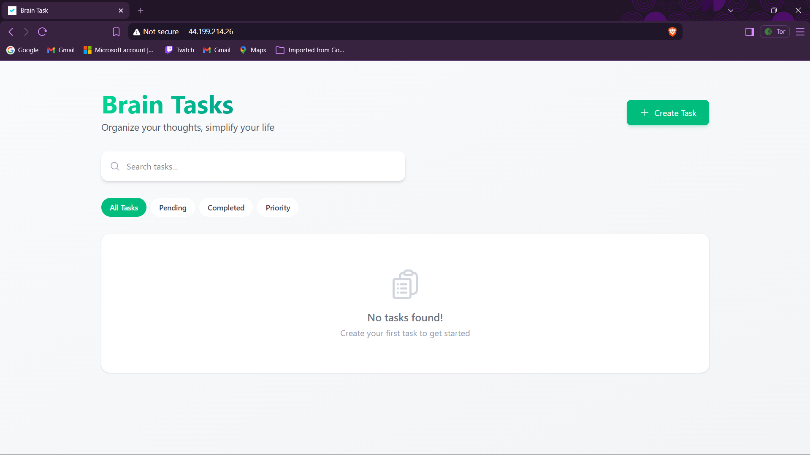
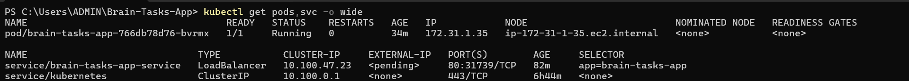
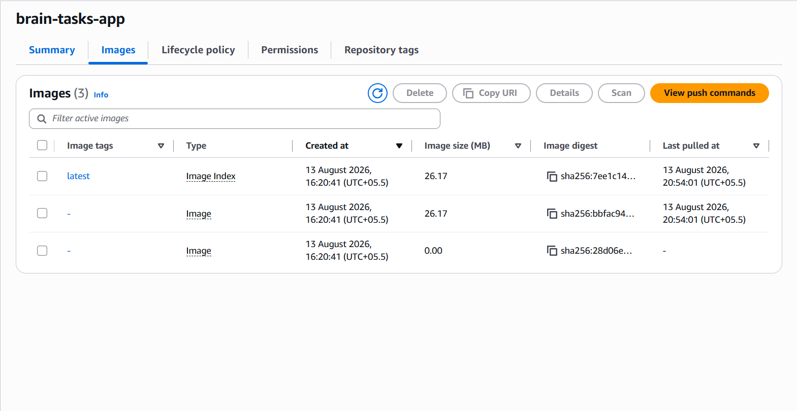
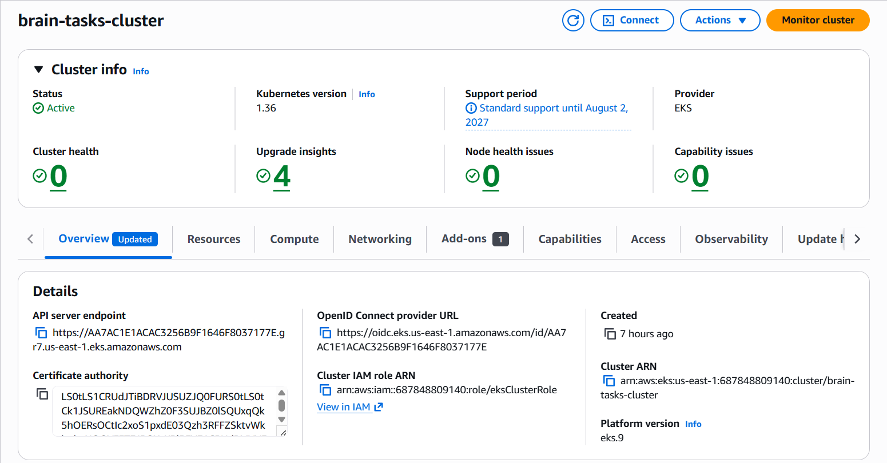
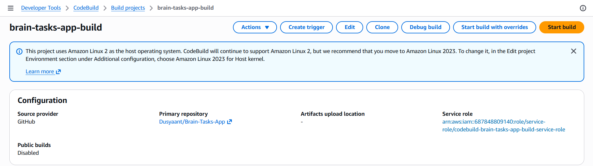
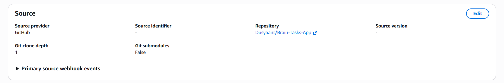
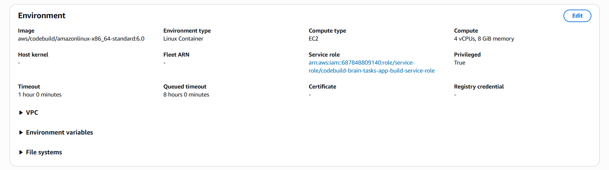
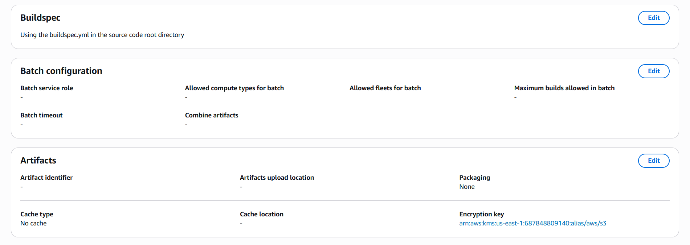
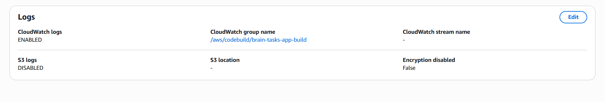

# 🧠 Brain Tasks App - AWS EKS & CI/CD Deployment

## 🚀 Project Overview
This repository contains the production-ready deployment of the **Brain Tasks App**. The application was successfully dockerized, pushed to Amazon Elastic Container Registry (ECR), and deployed to a Kubernetes cluster using Amazon Elastic Kubernetes Service (EKS). Continuous Integration and Deployment (CI/CD) were configured using AWS CodeBuild and AWS CodePipeline.

## 🛠️ Tech Stack & Architecture
- **Containerization:** Docker, Amazon ECR
- **Orchestration:** Kubernetes, Amazon EKS, `kubectl`, `eksctl`
- **CI/CD Automation:** AWS CodeBuild, AWS CodePipeline, `buildspec.yml`
- **Monitoring:** Amazon CloudWatch Logs

## ⚠️ AWS Account Restrictions (Disclaimer)
- **Load Balancer ARN:** Automated creation of the public Load Balancer ARN was blocked by an AWS environment restriction (`OperationNotPermitted`). 
- **CI/CD Execution:** The pipeline and `buildspec.yml` are fully configured with the correct IAM roles. However, execution was blocked by an AWS Free Tier quota restriction (`Cannot have more than 0 builds in queue for the account`). 
- **Resolution:** **Local port-forwarding and NodePort (Public IP) routing** were successfully utilized to bypass the Load Balancer restriction and verify the EKS deployment live in the cloud.

---

## 📸 Proof of Execution

### 1. Application Running Live (Bypassing LB Block)

*Application accessed successfully over the internet via the EC2 worker node's public IP and NodePort.*

### 2. Kubernetes Pods and Services Active

*EKS Cluster successfully running the deployment and service.*

### 3. Docker Image in AWS ECR

*Containerized application pushed to Elastic Container Registry.*

### 4. AWS EKS Cluster (Active)

*Kubernetes cluster successfully provisioned and active.*

### 5. CI/CD Pipeline & CodeBuild Configuration
**CodeBuild Project & GitHub Source Connection:**



**Privileged Environment (Docker Ready):**


**Buildspec Target & CloudWatch Config:**



---

## 💻 Setup & Deployment Instructions
1. **Clone the repository:**
   ```bash
   git clone [https://github.com/Dusyaant/MindTrack_Capstone_project.git](https://github.com/Dusyaant/MindTrack_Capstone_project.git)

```

2. **Build and push the Docker image:**
```bash
docker build -t brain-tasks-app .
docker push <your-ecr-uri>/brain-tasks-app:latest

```


3. **Deploy to Kubernetes (EKS):**
```bash
kubectl apply -f k8s/deployment.yaml
kubectl apply -f k8s/service.yaml

```


```

```
